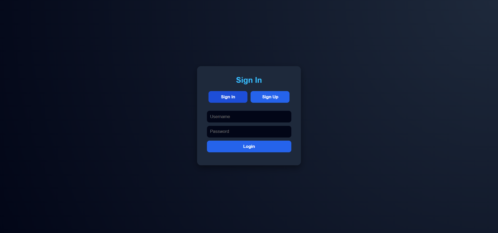
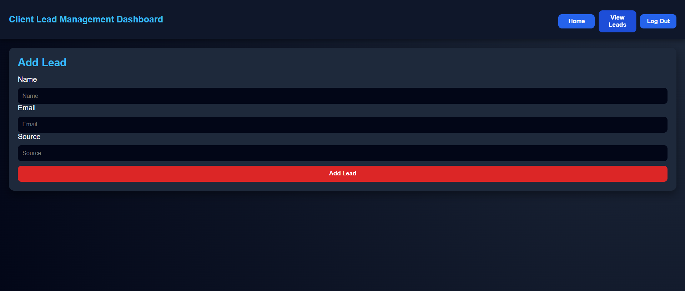

# 📊 CRM Leads Management System

## 📌 Project Overview

This is a full-stack Customer Relationship Management (CRM) system that enables administrators to efficiently manage leads through a secure and interactive dashboard.

The application supports authentication, lead tracking, status updates, and note management, providing a practical solution for handling customer data.

---
## 🚀 Live Demo
👉 https://de-bongz.github.io/FUTURE_FS_02/

---

## 💻 GitHub Repository
👉 https://github.com/De-Bongz/FUTURE_FS_02

---


## 🚀 Features

### 🔐 Authentication
- Secure admin login using JSON Web Tokens (JWT)
- Protected routes to restrict unauthorized access

### 📊 Lead Management
- Add new leads
- View all leads in a dashboard
- Update lead status (New, Contacted, Converted)
- Add notes to leads
- Delete leads

### 🧠 Dashboard
- Clean and responsive UI
- Real-time updates after actions

---

## 🛠️ Tech Stack

### Frontend
- HTML
- CSS
- JavaScript

### Backend
- Node.js
- Express.js

### Database
- MongoDB (Mongoose)

### Authentication
- JSON Web Token (JWT)

---
## 📸 Screenshots



---

## 📁 Project Structure

```
backend/
│── models/
│   ├── Admin.js
│   ├── Leads.js
│
│── server.js
│── .env
│── package.json
│
frontend/
│── login.html
│── index.html
│── style.css
│── script.js
```

---

## ⚙️ Setup Instructions

### 1. Clone Project
```
git clone <your-repo-url>
```

### 2. Install Backend Dependencies
```
cd backend
npm install
```

### 3. Setup Environment Variables
Create a `.env` file:
```
MONGO_URI=your_mongodb_connection_string
JWT_SECRET=your_secret_key

```

---

### 4. Start Backend Server
```
node server.js
```

Server runs on:
```
http://localhost:5000
```

---

### 5. Run Frontend
Open:
```
login.html
```
Using Live Server or browser

---

## 🔑 Default Login (if seeded manually)
```
username: admin
password: 1234
```

---

## 🔌 API Endpoints

### Auth
- `POST /login`

### Leads (Protected Routes)
- `GET /leads`
- `POST /leads`
- `PUT /leads/:id`
- `PUT /leads/:id/note`
- `DELETE /leads/:id`

---

## 🧪 Future Improvements

- Implement password hashing (bcrypt)
- Add search and filtering functionality
- Dashboard analytics (charts & insights)
- Role-based access control (Admin/User)
- Deploy to cloud (Render / Railway)

---

## 👨‍💻 Author

**Bongani Maluleke**  
Computer Science Student – University of the Western Cape (UWC)

---

## 💡 Project Purpose

This project was developed as part of a full-stack learning journey to build real-world applications using modern web technologies.

---

## 📄 License

This project is open-source and available for educational purposes.
